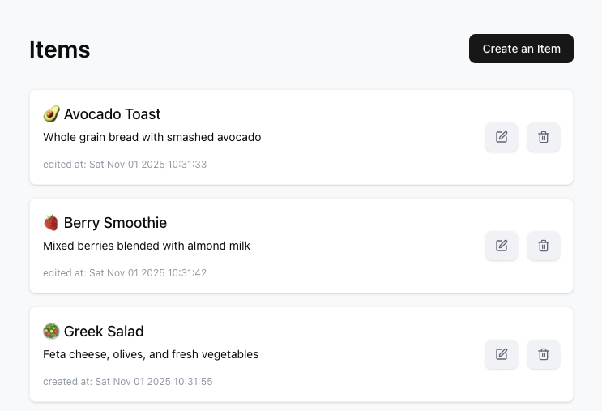

# List App

This project is a React-based application for managing a list of items, featuring full CRUD (Create, Read, Update, Delete) functionality.

## 📸 Preview



## ✅ Core Features

This application meets all the specified requirements:

- **List View:** Displays all items with their title, subtitle, and creation date.
- **Create Item:** A "Create" button opens a modal form to add a new item to the list.
- **Update Item:** An "Edit" button on each item opens the _same_ modal, pre-filled with the item's data, to allow updates.
- **Delete Item:** A "Delete" button on each item removes it from the list.

## ✨ Above & Beyond: Additional Features

I implemented several features beyond the core requirements to build a more robust and user-friendly application:

- **`localStorage` Persistence:** Saves the user's list between sessions, with robust date serialization to prevent data corruption.
- **Initialization Loading State:** Shows a spinner while loading data from storage to prevent UI pop-in.
- "**Edited At" Timestamp:** Tracks item edits separately from the creation date for a clearer history.
- **`react-hook-form` Validation:** Implements instant, inline error messages directly under the form fields.
- **Confirm-Delete Modal:** Prevents accidental data loss with a clear confirmation dialog before deletion.
- **Success Toasts (`Sonner`):** Provides non-intrusive "Item Created" and "Item Updated" feedback.
- **Guided Empty State:** Guides new users to create their first item instead of showing a blank list.
- **Fully Responsive Design:** Ensures a clean and usable experience on all devices, from mobile to desktop.
- **Typed & Modular Code:** Uses TypeScript and small, single-responsibility components for a clean, maintainable, and testable architecture.

## 🛠️ Tech Stack & Key Libraries

| Category             | Technology                            |
| :------------------- | :------------------------------------ |
| **Core**             | React (Functional Components & Hooks) |
| **Language**         | TypeScript / JavaScript               |
| **Styling**          | Tailwind CSS                          |
| **Form Management**  | React Hook Form                       |
| **State Management** | `useState`                            |
| **UI Components**    | shadcn/ui                             |

## 🧠 Architectural & Design Decisions

Here are the key technical choices I made and why:

1.  **Reusable Modal**

    > I used one modal for both "Create" and "Edit." It just checks for an `editingItem` prop to know whether to pre-fill the form. This keeps the logic and UI in one place, and making it easy to update.

2.  **Simple State (`useState`)**

    > I used React's built-in `useState` instead of a big state library. It's all this app needs, keeping it fast and easy to understand. It's simple to add Zustand or React Query later if the app grows.

3.  **Performant Forms (React Hook Form)**

    > I chose **React Hook Form** because it's fast and makes handling form validation clean and simple. The error logic stays right with the form.

4.  **Single Source of Truth**

    > One main component manages the list state and all updates to `localStorage`. This prevents bugs by ensuring the data is always consistent.

5.  **Safe Date Handling**

    > I save dates as strings (text) in `localStorage` and turn them back into `Date` objects when the app loads. This prevents common bugs where dates are treated as text.

6.  **Accessibility by Default**

    > I used **shadcn/ui** because it gives me great accessibility (like keyboard navigation and focus control in modals) right out of the box, making the app usable for everyone.

7.  **Easy to Test & Extend**
    > Using **TypeScript** and small, focused components makes the code clean and easy to test. This design means I can easily add new features, like Zod validation or a real backend, later on.

## 🚀 Getting Started Locally

To run this project on your local machine:

1.  **Clone the repository:**

    ```bash
    git clone https://github.com/fatemenm/list
    ```

2.  **Navigate to the project directory:**

    ```bash
    cd list
    ```

3.  **Install dependencies:**

    ```bash
    npm install
    # or
    yarn install
    ```

4.  **Run the development server:**

    ```bash
    npm run dev
    # or
    yarn dev
    ```

The application will be available at `http://localhost:5173`.
